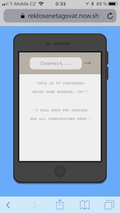
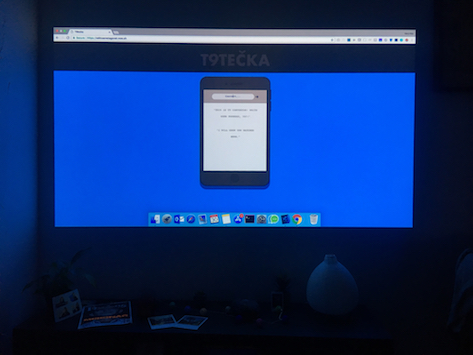
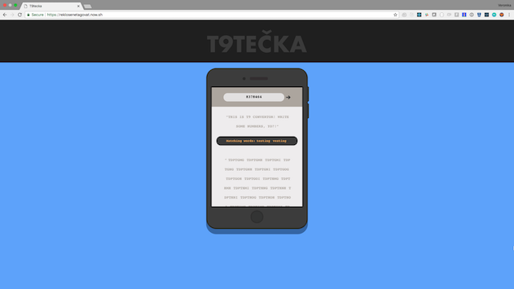

This project was bootstrapped with ejected [Create React App](https://github.com/facebookincubator/create-react-app).

DEMO: https://reklosenetagovat.now.sh/

Project is T9 convertor - the ugly annoying vintage phone keyboards feature we all know well. You can input up to 7 digits and app will convert them to all possibl letter combinations. After that app compares results with words in English dictionary. Dictionary contains just limited number of words, about 10 000 and some of them are pretty strange or looks more like letters only. Like `k`. Is it word, seriously?

What is included in this special sale price:
1. Easteregg - hidden Github link to source code. Find it!
2. All iPhone UI is CSS!
3. User friendly error handling! w Error Boundary (unfortunatelly handlers not included (╯°□°）╯︵ ┻━┻ )
3. My fuckups are clearly visible in commits - I dont even try to hide them. Because if I would try to do so I would fuckup even more.
4. Searching for words in dictionary - try put some meaningful digits like: 8378464 or 228
4. It is so awesome and so responsive - I can't believe my eyes, you can use iPhone, iPad, Big TV screen, projector - like aaaaw yeah! I dont recommend using IE because I decided to basically not support it or TRY to test it. Chrome is the choice! God save the Chrome!

  

Express server creates endpoint and endpoint offers results returned by functions for:
1. converting digits to letters
2. comparing converted results with dictionary (based on Cartesian Product mathematic operation or I hope so because I hapilly got inspired from discussions on StackOverFlow and we know the opinios of opinions of opinios are sometimes `false`).

In the project directory, you can run (some of us rather walk):

### `yarn start-dev`

Runs scripts needed for running frontend and API endpoint on one port for development. 
Open [http://localhost:3000](http://localhost:3000) to view it in the browser.

### `yarn start`

I use this command during deploy. I am using Now.sh and it use default `yarn start` 
I recommend not using this command for development mode. Or lets say it clearly. Dont use it, it wont work! 
Use `yarn start-dev` instead

### `yarn test`

Launch the test runner in the interactive watch mode. 
See the section about [running tests](#running-tests) for more information.

### `yarn build`

Builds the app to be production ready to the `build` folder. 
It correctly bundles React in production mode and optimizes the build for the best performance.

The build is minified and the filenames include the hashes. 

## Deployment

Demo of this app is deployed and can be re-deployed by Now.sh easily.
In command line install `yarn -g now` and use `now` command.
Or do it by drag&drop in Now.sh desktop app.
